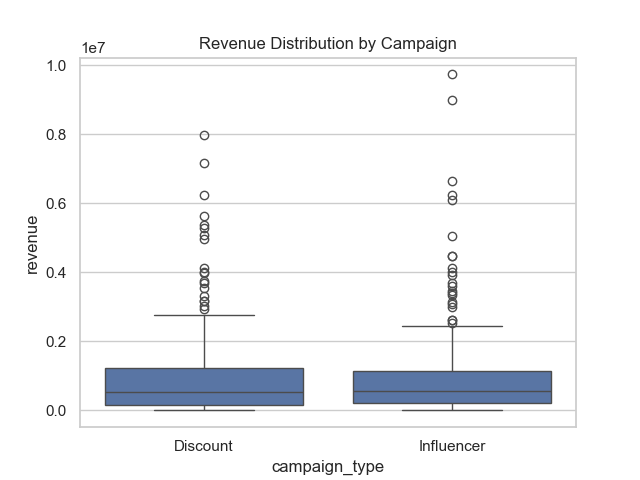
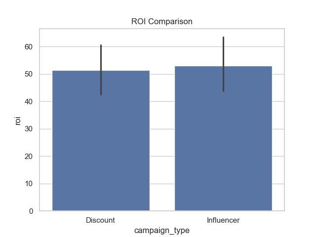
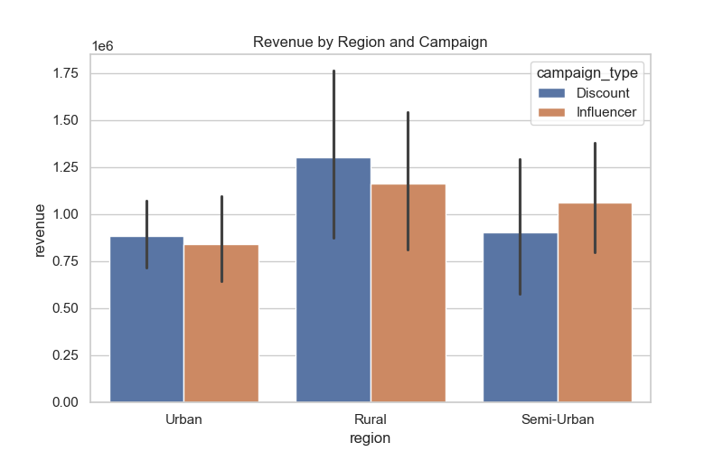

# 📊 Marketing Campaign A/B Testing Dashboard

## 📌 Project Overview

In this project, I analyzed the performance of a product under two different marketing strategies — **Influencer Campaign** and **Discount Campaign**.

The main objective was to understand **which campaign performs better and under what conditions**, rather than just comparing overall numbers. I approached this problem from a data analyst perspective by focusing on **business impact, regional differences, and campaign effectiveness**.

---

## 🎯 Problem Statement

From a business point of view, companies often face questions like:

* Which marketing strategy gives better returns?
* Do different regions respond differently to campaigns?
* Should we invest more in influencers or discounts?

This project aims to answer these questions using data.

---

## 🧠 Approach & Thinking

Instead of directly jumping into conclusions, I followed a structured approach:

* First, I **prepared and cleaned the dataset using Python**
* Then, I explored the data to understand patterns in:

  * Revenue
  * Conversion rates
  * Regional performance
* I used **A/B testing logic** to compare two campaigns fairly
* Finally, I built a **Power BI dashboard** to visualize and communicate insights clearly

This helped me not just analyze data, but also **think like a data analyst solving a business problem**

---

## ⚙️ Tools & Technologies Used

* **Python** (Pandas, Matplotlib, Seaborn) → Data cleaning & analysis
* **Power BI** → Interactive dashboard & visualization
* **Jupyter Notebook** → Analysis workflow

---

## 📊 Dashboard Highlights

The dashboard focuses on key business metrics:

* **Total Revenue, Conversion Rate, and Units Sold (KPIs)**
* **Campaign-wise comparison (Influencer vs Discount)**
* **Region-wise performance (Urban, Semi-Urban, Rural)**
* **ROI comparison to evaluate profitability**
* **Interactive filtering to analyze data dynamically**

---

## 📸 Dashboard Preview

---

## 📊 Key Visualizations

### 💰 Revenue by Campaign

### 📈 ROI Comparison

### 🌍 Revenue by Campaign and Region

---

## 🧠 Key Business Insights

* Influencer campaigns perform better in **urban regions**, indicating stronger brand influence and customer trust
* Discount campaigns generate **higher overall sales volume**, especially in price-sensitive markets
* ROI is **comparable across both campaigns**, with a slight advantage for discount strategies
* Campaign effectiveness **varies significantly by region**, showing that a single strategy does not work everywhere

---

## 💡 Business Recommendations

Based on the analysis:

* Use **influencer marketing in urban areas** to maximize engagement
* Apply **discount strategies in rural or price-sensitive regions** to drive volume
* Combine both strategies depending on region instead of using a single approach
* Focus on ROI, not just sales, when making marketing decisions

---

## 🚀 What I Learned

* How to approach a problem from a **business + data perspective**
* How to perform **comparative analysis using A/B testing concepts**
* How to use **Python for analysis and Power BI for storytelling**
* The importance of **turning data into actionable insights**

---
